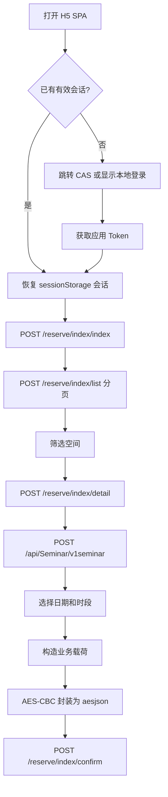

# 浙江大学图书馆空间预约系统接口初步分析

分析日期：2026-09-04

目标页面：`https://booking.lib.zju.edu.cn/h5/index.html#/login`

本次只观察正常页面加载、登录状态恢复、空间列表、空间详情和预约表单流程。未发送最终预约确认请求，也未进行并发、重试轰炸或访问控制绕过。

## 1. 前端结构

- 应用类型：单页应用（SPA），使用 Hash Router。
- 页面入口：`/h5/index.html`。
- 主脚本：`/h5/assets/index.1782805514175.js`。
- UI 组件：同时使用 Vuetify 风格组件和 Vant 组件。
- 构建方式：Vite 动态分块；空间预约相关分块包括：
  - `SeatList.1782805514175.js`
  - `QuickChoose.1782805514175.js`
  - `RoomItem.1782805514175.js`
  - `seminarMakeCom.1782805514175.js`
  - `seminarUploadNew.1782805514175.js`
  - `seminarUploadCom.1782805514175.js`
- 请求库：Axios。
- Axios 基础配置：
  - `baseURL: "/"`
  - `timeout: 60000`
  - `withCredentials: true`
  - `Content-Type: application/json`
  - `X-Requested-With: XMLHttpRequest`

## 2. 登录与会话

### 2.1 当前站点的正常登录链路

本次浏览器中已经存在有效登录状态。页面首先请求：

```text
POST /api/cas/user
```

前端还包含独立的 CAS 回调页面。该页面读取 URL 查询参数 `cas`，再交给主脚本中的认证逻辑换取应用会话。

前端根据 `/api/index/config` 返回的 `config.login` 决定显示本地账号密码表单，还是跳转到 `config.cas_url`。值为 `4` 或 `8` 时会使用 CAS 跳转。

### 2.2 本地账号密码表单

前端仍保留本地登录接口：

```text
POST /api/Captcha/verify
POST /api/login/login
```

验证码接口返回结构：

```json
{
  "code": 1,
  "message": "...",
  "info": {
    "base64": "data:image/...",
    "key": "...",
    "md5": "..."
  }
}
```

登录原始业务字段为：

```json
{
  "username": "学工号",
  "password": "密码",
  "code": "验证码",
  "key": "验证码接口返回的 key",
  "open_id": "可选"
}
```

`/api/login/login` 属于加密请求，线上发送的并不是上述明文对象，详见“请求加密”。登录成功后，前端将以下数据写入会话存储：

- `sessionStorage.token`
- `sessionStorage.UserInfo`
- `localStorage.lang`
- 可选的 `localStorage.openId`

分析文件和后续脚本不得保存账号密码、Token 或完整 `UserInfo`。

## 3. 通用请求约定

存在 Token 时，前端会同时使用请求头和 JSON 请求体传递授权信息：

```text
authorization: bearer<TOKEN>
lang: zh
```

JSON 请求体还会附加：

```json
{
  "authorization": "bearer<TOKEN>"
}
```

注意：前端代码拼接的是 `bearer` 与 Token，中间没有空格。实现时应以实际前端行为为准。

`/reserve/index/*` 查询接口会先执行 `cleanObject`。以下值会从请求对象中删除：

- `null` 或 `undefined`
- 空字符串
- `length === 0` 的空数组或空集合

响应成功码并不统一：

- 新版 `/reserve/index/*`：观察到成功时 `code === 0`。
- 部分旧版 `/api/Seminar/*`：前端按 `code === 1` 判断成功。
- `code === 10001`：前端清空本地会话并跳转验证页面。

## 4. 空间检索接口

空间预约的 `reserveType` 为 `2`。

### 4.1 筛选元数据

```text
POST /reserve/index/index
```

请求体：

```json
{
  "id": 2
}
```

主要响应字段：

- `data.premises`：馆舍。
- `data.storey`：楼层。
- `data.category`：空间类型。
- `data.noise`：噪音类型。
- `data.boutique`：空间特征。
- `data.date`：可选择日期。
- `data.spaceTime.spaceOpenTime`、`spaceCloseTime`：可选时间范围。
- `data.members`：人数筛选信息。

本次观察到馆舍包括主馆、基础馆和农医馆。

### 4.2 快速选择

```text
POST /reserve/index/quickSelect
```

请求体字段：

```json
{
  "id": 2,
  "date": "YYYY-MM-DD",
  "premisesIds": [],
  "categoryIds": [],
  "storeyIds": [],
  "noiseId": "",
  "boutiqueIds": [],
  "startTime": "HH:mm",
  "endTime": "HH:mm",
  "members": ""
}
```

空值会被 `cleanObject` 删除。响应主要包含：

- `data.premises`
- `data.storey`
- `data.area`
- `data.date`

`data.area[]` 的关键字段：

- `id`：空间 ID。
- `nameMerge`：馆舍、楼层和空间合并名称。
- `typeCategory`：空间类型。
- `Fully_Booked`：是否已约满。
- `bookDay`：可预约日相关配置。
- `earlierPeriods`：提前预约配置。

### 4.3 分页空间列表

```text
POST /reserve/index/list
```

请求体字段：

```json
{
  "id": 2,
  "name": "空间名称搜索词",
  "date": "YYYY-MM-DD",
  "premisesIds": [],
  "categoryIds": [],
  "storeyIds": [],
  "noiseId": "",
  "boutiqueIds": [],
  "startTime": "HH:mm",
  "endTime": "HH:mm",
  "members": "",
  "size": 50,
  "page": 1
}
```

主要响应字段：

```text
data.page
data.size
data.totalPage
data.count
data.list[]
```

`data.list[]` 包含空间 ID、名称、馆舍/楼层、空间类型、是否约满、特征、噪音、图片和人数限制。

### 4.4 空间详情

```text
POST /reserve/index/detail
```

请求体：

```json
{
  "id": 2,
  "areaId": "空间 ID",
  "date": "YYYY-MM-DD"
}
```

主要响应字段：

- `data.id`、`data.space_id`
- `data.nameMerge`
- `data.type_id`、`data.type_name`
- `data.maxPerson`
- `data.readonlyTitle`
- `data.earlierPeriods`
- `data.noise[]`
- `data.boutique[]`
- `data.title[]`
- `data.Fully_Booked`

## 5. 普通座位接口

普通座位使用 `reserveType=1`，与空间预约的列表接口分开处理。

### 5.1 座位区域列表

空间列表接口仍可用于获得主馆的座位区域：

```text
POST /reserve/index/list
```

请求体核心字段：

```json
{
  "id": 1,
  "date": "YYYY-MM-DD",
  "premisesIds": ["53"],
  "categoryIds": ["1"],
  "size": 50,
  "page": 1
}
```

普通座位区域示例：

```text
id: 58
nameMerge: 主馆-二层-二层南
type_id: 1
```

### 5.2 座位日期和时间段

```text
POST /api/Seat/date
```

请求体：

```json
{
  "build_id": "座位区域 ID"
}
```

响应为日期数组；每个日期的 `times[]` 包含：

```text
day
times[].id
times[].start
times[].end
times[].status
```

### 5.3 具体座位

```text
POST /api/Seat/seat
```

请求体：

```json
{
  "area": "座位区域 ID",
  "segment": "时间段 ID",
  "day": "YYYY-MM-DD",
  "startTime": "HH:mm",
  "endTime": "HH:mm"
}
```

响应中的座位字段包括：

```text
id
name / no
status
status_name
area
labels
```

观察到 `status=1` 表示空闲。客户端会在每个可用时间段查询座位，并把 `segmentId` 一并输出，避免只依据区域总数做错误判断。

### 5.4 普通座位确认

```text
POST /api/Seat/confirm
```

前端提交的原始业务对象为：

```json
{
  "seat_id": "具体座位 ID",
  "segment": "时间段 ID"
}
```

该接口位于前端加密白名单中，线上请求体使用与空间确认相同的 `aesjson` AES-CBC 封装。当前客户端只在用户输入 `BOOK_CONFIRM` 后发送一次该请求。

## 6. 具体房间与时段接口

当前本地客户端使用新版空间详情接口和旧版时段接口的组合；没有把早期观察到的
`/api/Seminar/detail` 作为预约前置步骤。`quickSelect` 是页面正常流程中观察到的
接口，但命令行客户端直接使用分页列表接口，以减少一次不必要的请求。

### 6.1 房间详情

```text
POST /reserve/index/detail
```

请求体：

```json
{
  "id": 2,
  "areaId": "空间 ID",
  "date": "YYYY-MM-DD"
}
```

响应中包含空间类型、人数限制、预设标题、联系人字段、设备和上传要求等信息。

### 6.2 日期与可用时段

```text
POST /api/Seminar/v1seminar
```

请求体：

```json
{
  "room": "空间 ID",
  "area": "馆舍或上级区域 ID"
}
```

主要响应为 `data.list[]`，每项对应一个日期及其 `info`。前端使用的 `info` 字段包括：

- `Fully_Booked`
- `startTime`
- `endTime`
- `minTime`
- `maxTime`
- `list[]`：已占用或禁用时段

前端时间滑块以分钟表示时间，并将最终值转换为 `HH:mm`。

## 7. 最终预约确认接口

```text
POST /reserve/index/confirm
```

标准空间预约的原始业务载荷为：

```json
{
  "id": 2,
  "day": "YYYY-MM-DD",
  "start_time": "HH:mm",
  "end_time": "HH:mm",
  "title": "申请标题",
  "content": "申请内容",
  "mobile": "联系电话",
  "room": "空间 ID",
  "open": "1",
  "file_name": "",
  "file_url": "",
  "titleId": "可选标题 ID",
  "teamusers": "可选，成员 ID 逗号分隔",
  "device": [
    {
      "id": "设备 ID",
      "needNum": 1
    }
  ],
  "device_agree": 0
}
```

字段是否必填由空间详情和时段配置决定。例如，多人研讨间会校验参与人数；部分空间要求预设标题、申请内容、手机号、图片或设备协议。

本次分析没有发送该接口。

## 8. 请求加密

以下接口位于前端加密白名单中：

- `/api/login/login`
- `/reserve/index/confirm`
- 以及密码重置、座位确认、二维码预约等敏感接口

加密方案：

```text
算法：AES-CBC
填充：PKCS#7
输出：CryptoJS 默认 Base64 字符串
Key：YYYYMMDD + reverse(YYYYMMDD)
IV：ZZWBKJ_ZHIHUAWEI
明文：JSON.stringify(原始业务载荷)
```

线上实际请求体形态：

```json
{
  "aesjson": "Base64 AES 密文",
  "authorization": "bearer<TOKEN>"
}
```

实现时不应在源码中保存账号、密码或 Token。建议在浏览器正常登录后复用临时会话，并在预约前按当天日期动态生成加密 Key。

## 9. 推荐的软件实现方式

首选“浏览器正常登录 + 本地辅助程序”的方式，而不是把账号密码硬编码进脚本：

1. 使用 Playwright 持久化浏览器配置，由用户完成一次 CAS 登录。
2. 在已登录页面上下文中读取空间列表与时段，不导出 Token 到磁盘。
3. 将目标馆舍、空间类型、日期、起止时间和候选房间做成配置。
4. 在开放时间附近以温和频率刷新可用性；加入随机抖动和指数退避。
5. 找到可用空间后只提交一次；收到明确业务失败码后重新查询，禁止并发重复提交。
6. 默认提供“提交前确认”模式；用户明确开启后才允许自动提交。
7. 输出脱敏日志，不记录密码、Token、手机号和参与人学号。

这种方式兼容 CAS、验证码、Cookie 和前端接口变化，也更容易遵循系统预约规则。

## 10. 本地客户端实现

项目根目录新增：

```text
zju-booking.mjs
package.json
package-lock.json
test/zju-booking.test.mjs
README.md
```

客户端命令：

```text
node zju-booking.mjs login
node zju-booking.mjs query --type=seat --date=tomorrow
node zju-booking.mjs query --type=singleStudy --date=tomorrow
node zju-booking.mjs query --type=seminar --date=YYYY-MM-DD
node zju-booking.mjs book ...
```

实现约束：

- 使用 Playwright 持久化浏览器配置，让用户完成正常登录；账号密码不进入源码或命令行参数。
- 查询请求在登录页面上下文中发起，因此 Cookie、Token 和同源策略由浏览器处理，Token 不写入磁盘。
- 普通座位查询使用 `/api/Seat/date` 和 `/api/Seat/seat`；单人研习间和多人研讨间使用空间列表、空间详情和 `/api/Seminar/v1seminar`。
- `/api/Seat/confirm` 和 `/reserve/index/confirm` 仅在显式确认后调用，并且每次运行最多调用一次。
- `book` 不带 `--confirm` 时只执行可用性检查并打印脱敏预览，不发送最终确认请求。
- 当前命令行版本尚未覆盖图片上传、设备申请及成员学号到系统成员 ID 的检索。

## 11. 流程图



## 12. 结论与待确认项

已经确认的空间预约关键链路：

```text
/api/cas/user
  -> /reserve/index/index
  -> /reserve/index/quickSelect
  -> /reserve/index/list
  -> /reserve/index/detail
  -> /api/Seminar/v1seminar
  -> /reserve/index/confirm
```

普通座位关键链路：

```text
/reserve/index/list (id=1)
  -> /api/Seat/date
  -> /api/Seat/seat
  -> /api/Seat/confirm
```

实际提交前仍需要用户确定：

- 预约对象是单人研习间、多人研讨间，还是普通座位。
- 目标馆舍、楼层、候选空间和时间段。
- 预约标题、用途、联系电话及多人空间的参与人规则。
- 使用“发现后提醒并手动确认”，还是“符合条件后自动单次提交”。

本地客户端当前默认选择“提交前确认”，并且没有自动发送过真实确认请求。
