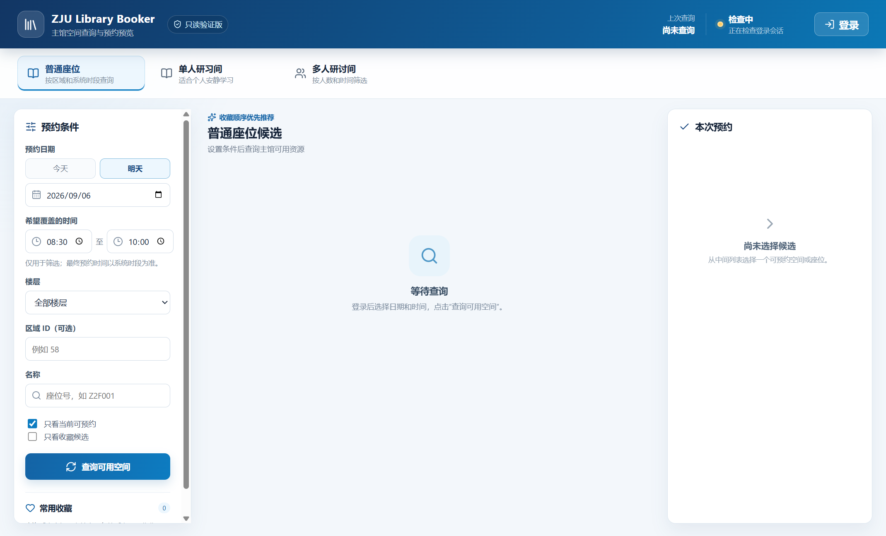

# ZJU Library Booker

浙江大学图书馆预约系统的非官方本地查询与预约辅助工具，当前版本为 **0.1.0 初代版本**。

维护者：[CPbianma](https://github.com/CPbianma)

> 本项目与浙江大学及其图书馆没有官方隶属关系。请遵守学校和图书馆的服务条款，合理使用查询功能。

项目现在包含 **ZJU Library Booker 桌面界面** 和原有命令行工具，支持主馆的：

- 普通座位
- 单人研习间
- 多人研讨间

支持 `today`、`tomorrow` 和 `YYYY-MM-DD` 三种日期写法。

## 桌面界面（第一阶段）

桌面版使用 Electron、React 和 TypeScript，当前已经接入：

- 独立的统一身份认证窗口和登录状态显示；
- 普通座位、单人研习间、多人研讨间三类只读查询；
- 日期、时间、楼层、区域或空间 ID、名称筛选；
- 座位卡片、空间卡片和可用时间轴；
- 非敏感收藏、收藏顺序调整和推荐候选标记；
- 脱敏预约预览；
- 手动刷新和三秒防重复点击倒计时。

第一阶段桌面版**没有注册任何预约确认 IPC，也没有包含 `/api/Seat/confirm` 或
`/reserve/index/confirm`**。界面中的提交按钮固定禁用，只能查询和生成预览。

桌面版是本次 0.1.0 的主要使用入口。它只保存非敏感的收藏偏好；登录 Cookie、会话
Token、手机号、用途和参与人信息不会提交到本仓库。

## 界面预览

初始界面不包含任何账号、密码、Token 或个人预约数据：



登录窗口会在需要时单独打开，认证成功后自动隐藏；桌面版第一阶段只提供查询和预览。

安装依赖并启动开发模式：

```powershell
npm install
npm run dev
```

在右上角点击“登录”，在独立窗口中完成正常统一身份认证。登录成功后认证窗口会
自动隐藏，主窗口状态会变为“已登录”。不要在终端或配置文件中填写密码。

桌面版收藏只保存预约类型、目标 ID、名称、地点、楼层和顺序，不保存手机号、用途、
参与人、账号、密码或 Token。桌面版会话与收藏位于 Electron 的应用数据目录，不使用
命令行版的 `.zju-booking-profile/`。

类型检查和构建：

```powershell
npm run typecheck
npm run build
```

`npm run build` 目前生成开发验收所需的 Electron 产物，不生成安装包或便携 EXE。
构建完成后可以执行 `npm start` 或 `npm run desktop` 打开构建版桌面应用。
原命令行工具保留在独立的 `npm run cli -- <命令>` 入口，不会被桌面 Renderer 调用。

## 命令行工具

命令行工具用于保留已有的接口验证和高级操作。桌面版不会调用命令行工具。

### 安装

```powershell
npm install
```

首次使用时执行：

```powershell
node zju-booking.mjs login
```

浏览器会打开预约系统。请在浏览器中按网站正常流程完成浙大统一身份认证；回到终端按 Enter 后，程序只检查是否已经建立应用会话，不会读取或保存密码。

浏览器配置保存在 `.zju-booking-profile/`，其中可能包含登录 Cookie 和会话信息，已加入 `.gitignore`，不要复制或上传这个目录。

## 只读查询

普通座位：

```powershell
node zju-booking.mjs query --type=seat --date=tomorrow
```

指定主馆区域查询座位：

```powershell
node zju-booking.mjs query --type=seat --date=tomorrow --roomId=58
```

单人研习间：

```powershell
node zju-booking.mjs query --type=singleStudy --date=tomorrow --name=5SC01
```

多人研讨间：

```powershell
node zju-booking.mjs query --type=seminar --date=2026-09-06
```

查询结果会输出空间 ID、预约状态、可预约时间、最短/最长时长、已占用时段等信息。普通座位结果还会输出具体座位 ID 和 `segmentId`。

## 预约预览和单次提交

`book` 默认只做可用性检查并打印预览，不会发送最终确认请求：

```powershell
node zju-booking.mjs book `
  --type=singleStudy `
  --date=tomorrow `
  --areaId=125 `
  --startTime=08:30 `
  --endTime=10:00 `
  --title=单人研习 `
  --content=学习 `
  --mobile=你的手机号
```

只有同时满足以下条件才会提交：

1. 命令中带有 `--confirm`；
2. 终端中再次输入精确的 `BOOK_CONFIRM`；
3. 目标空间或座位通过提交前的可用性检查。

普通座位预约需要使用查询结果中的区域 ID、座位 ID 和时间段 ID：

```powershell
node zju-booking.mjs book `
  --type=seat `
  --date=tomorrow `
  --roomId=58 `
  --seatId=6046 `
  --segmentId=1554059 `
  --confirm
```

单人研习间：

```powershell
node zju-booking.mjs book `
  --type=singleStudy `
  --date=tomorrow `
  --areaId=125 `
  --startTime=08:30 `
  --endTime=10:00 `
  --title=单人研习 `
  --content=学习 `
  --mobile=你的手机号 `
  --confirm
```

多人研讨间还需要根据网站要求填写参与人 ID；提交账号本身按 1 人计入：

```powershell
node zju-booking.mjs book `
  --type=seminar `
  --date=tomorrow `
  --areaId=研讨间空间ID `
  --startTime=09:00 `
  --endTime=11:00 `
  --title=小组讨论 `
  --content=课程讨论 `
  --mobile=你的手机号 `
  --teamusers=成员ID1,成员ID2 `
  --confirm
```

## 当前实现边界

- 所有查询都在登录后的浏览器页面上下文中发起，Token 不导出到本地文件。
- 最终预约接口按网站前端使用的 AES-CBC/PKCS#7 方式在页面上下文中动态封装。
- 普通座位和空间预约各只允许一次最终提交；程序不会并发抢占、批量囤积或无限重试。
- 多人研讨间的图片上传、设备申请和复杂成员检索尚未做成命令行参数；如果目标空间要求这些字段，请先在网页端完成，或后续扩展载荷。
- 本项目没有自动发送过真实预约确认请求；首次使用请先运行 `query` 和不带 `--confirm` 的 `book` 预览，核对日期、空间、时间和手机号。

## 隐私与仓库内容

- 不要把账号、密码、手机号、Cookie、Token、浏览器 Profile 或本地配置提交到 Git；
- `.zju-booking-profile/`、`node_modules/`、`out/`、`.env*` 和内部 `work/` 目录已被忽略；
- 本仓库只包含源代码、测试、接口说明和公开的项目文档；
- 如果曾经在聊天、终端或其他地方暴露过密码，请及时修改密码。

## 开发检查

```powershell
npm run typecheck
npm test
npm run build
```

版本变更记录见 [`CHANGELOG.md`](CHANGELOG.md)。

贡献者信息见 [`CONTRIBUTORS.md`](CONTRIBUTORS.md)。

完整参数可执行：

```powershell
node zju-booking.mjs help
```
